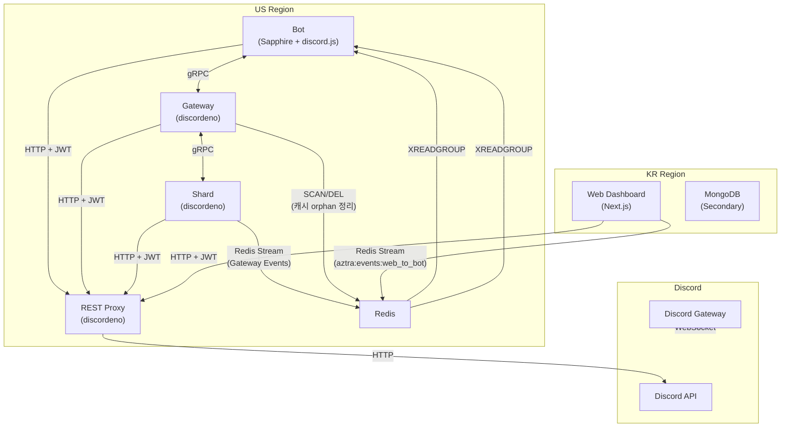

import { Image } from 'astro:assets';
import aztraLogo from '@/assets/articles/aztra-development/aztra.png'
import inftLogo from '@/assets/articles/common/inft-logo.png'
import aztraServerCount from '@/assets/articles/aztra-development/aztra-server-count.png'
import aztarSystemLegacy from '@/assets/articles/aztra-development/aztra-system-lagacy.png'

# 시작하며

현재 1.3만곳 이상의 디스코드 서버에서 사용 중인 관리봇 [Aztra](https://aztra.xyz)의 레거시 인프라 시스템을 처음부터 재설계하고 구현하며 제가 내렸던 판단, 부딪혔던 문제와 떠올린 생각들을 정리합니다. 이 과정에서 제가 느낀 점과 얻은 지식을 공유하고, 규모가 큰 작업인만큼 제 스스로도 작업의 방향성을 잃어버리지 않기 위해 생각을 차근차근 정리해가는 게 필요하다고 생각하여 잠시 코드 타이핑을 멈추고 시간을 들여 이 시리즈를 써보고자 합니다.

이 시리즈는 디스코드 봇 개발에 필요한 [Discord API](https://docs.discord.com/developers/intro) 관련 배경지식이 필요합니다. 본문에서는 Discord 및 Discord API에 관한 기본 지식과 용어(길드, 채널, 메시지, 토큰, 레이트 리밋, 웹소켓, 샤딩, REST, 인터랙션 등...)를 알고 있다고 가정하고 설명합니다.

## 정식 출시 이전

저는 지금으로부터 약 6년 전 2020년 9월부터 디스코드 봇 'Aztra'를 개발하기 시작했습니다. 벌써 시간이 많이 흘렀네요.

<Image class="mx-auto py- w-48" src={aztraLogo} alt="Aztra 로고" width={512} />

이 당시 저는 중학교 3학년이었습니다. 어릴 때부터 뭔가 만드는 것에 관심이 많았고, 초등학교 5학년부터 엔트리, 중학교 1학년부터 파이썬을 다루며 개발 경험을 쌓아갔습니다. 그러다가 웹 개발을 처음 배우기 시작한 중학교 3학년 때부터, 사람들이 직접 사용할 수 있는 서비스를 만들어보고자 했고 첫 프로젝트로 이 Aztra 프로젝트를 시작했습니다.

<Image class="mx-auto py-4 w-48" src={inftLogo} alt="Infinite Studio 로고" width={512} />

당시 엔트리 게임 개발팀으로 [Infinite Studio](https://inft.kr)라는 이름의 개발팀을 창설하여 다양한 엔트리 게임을 개발했었는데, 이때를 기점으로 디스코드 봇 개발을 메인으로 방향을 정했습니다.

## 정식 출시

그리고 한참 개발을 이어가다 2021년 1월 21일, Aztra를 정식 출시했습니다.

<Image class="mx-auto py-4" alt="" src={aztraServerCount} />

위 그래프는 2021년 1월 출시 이후 약 1년간 수집했던 Aztra 사용 서버수 통계입니다.

처음 몇 달동안은 하루 1\~2서버씩 매우 완만하게 증가하며 서버수 200개까지 증가했습니다. 그러다 2021년 5월 이후 급격하게 사용자가 늘어나며 하루에 최대 15서버씩 증가하기도 했습니다. 그래프에 나타난 기간 이후에도 꾸준하게 사용자가 증가하며 2026년 9월 기준 13,000개 서버를 돌파하며 성장하고 있습니다.

## 드러난 한계

그러나 봇이 성장할수록 설계와 성능상의 한계점이 점점 드러나기 시작했습니다. 제대로 된 기반 인프라 설계 없이 무작정 기능 구현에만 치중한 나머지, 중복된 코드, 비효율적고 비일관적인 코드베이스로 인해 유지보수가 힘들어지고 캐싱 정책 미흡으로 인한 메모리 부족, DB 스키마 설계 미스와 인덱싱 미흡으로 인한 슬로우 쿼리 등 성능 저하 문제가 급격하게 나타나기 시작했습니다.

예상치 못한 급격한 트래픽이 발생할 때마다, 우리 시스템은 성능 저하를 반복하고, 제대로 된 복구 프로세스가 없어 서비스 하나에 치명적인 오류가 발생해 프로세스가 죽으면 수동으로 조치하기 전까지 그대로 시스템이 마비가 되었습니다.

이 외에도 후술할 다양한 이유로 인해 기존 시스템 코드를 갈아엎고 신중한 설계를 바탕으로 재개발하는 작업을 시작하게 되었습니다.

# 기존 설계

<Image class="mx-auto py-4" alt="기존 설계" src={aztarSystemLegacy} />

초기 개발부터 지금까지, 기존 Aztra 시스템을 구성하는 서비스들의 개략적인 다이어그램입니다.

## 서비스 구성 요소

위 다이어그램에 나타난 서비스 구성 요소들을 하나씩 살펴봅시다.

- **Command Client(명령어 처리 클라이언트)**: 디스코드 서버에서 사용자들이 사용하는 다양한 명령어들[^cmds]을 처리합니다. Python 기반 discord.py로 개발되었습니다.
- **Interaction Client(인터랙션 처리 클라이언트)**: 2022년경에 디스코드에 추가된 기능인 슬래시 커맨드, 버튼, 모달 등의 **인터랙션[^desc-interaction]** 기능 관련 이벤트 처리를 담당합니다. Node.js 기반 discord.js로 개발되었습니다.
- **Subtask Client(서브태스크 클라이언트)**: 통계 수집 등 **반복적이고 주기적인 작업을 처리**하는 데 특화된 클라이언트. 메시지 수 통계, 서버 멤버 수 통계 등을 주기적으로 수집해서 DB에 업로드합니다. Node.js 기반 discord.js로 개발되었습니다.
- **Backend Client(백엔드 클라이언트)**: Aztra가 웹 대시보드 기능을 지원하기 시작하면서, **웹 백엔드에서 Discord API와 통신**하여 서버, 채널, 메시지, 사용자 등 필요한 Discord 데이터를 가져오기 위해 백엔드 API(Express)에 함께 통합되어 돌아가는 클라이언트입니다. Node.js 기반 discord.js로 개발되었습니다.
- **데이터베이스**: 다양한 시스템 데이터를 저장하는 MySQL 데이터베이스.
- **웹 대시보드 서비스**: Aztra 봇 설정을 커스터마이징하고 통계 확인 등을 할 수 있는 대시보드 사이트입니다. Node.js 기반 Next.js 기반으로 개발되었습니다.

# 문제 인식

## 기술 스택의 비일관성

웹 대시보드 기능과 인터랙션 기능이 있기 전, 최초에 우리 서비스는 `.청소`, `.경고` 등 기본적인 챗봇 명령어를 처리하는, 상술했던 **명령어 처리 클라이언트**만이 있었습니다. 2020년 당시 저는 할 줄 아는 언어가 Python밖에 없었기 때문에, Python 기반의 Discord 봇 개발 라이브러리인 [discord.py](https://github.com/rapptz/discord.py)를 사용하여 개발했습니다. 처음 이 라이브러리로 개발을 할 때에는 배우기도 쉽고 문법도 간편한 훌륭한 라이브러리였습니다. 그러나 몇 가지 문제점을 체감하게 되어, 이후로 개발한 클라이언트는 모두 Node.js를 기반으로 했습니다.

### Python 타입 체크의 부재

기본적으로 파이썬은 런타임에 객체 타입이 결정되는 **동적 타이핑(Dynamic Typing)** 언어입니다. 이러한 특성으로 인해, 개발자가 코드를 작성하는 동안 값이 이동하는 경로가 복잡해지면, 타입 추론 체인이 깨져 IDE가 값의 타입을 놓치게 되는 경우가 자주 발생합니다. 아래 예시를 봅시다:

```python
# [예시] IDE가 타입을 놓치는 전형적인 흐름

def fetch_user_data():
    return {"name": "Alice", "age": 30} # 여러 타입이 들어 있는 dict 반환

def process_info(data):
    # IDE는 data가 dict라는 것만 알 뿐, 안의 값 타입을 모름
    return data["name"]

user_name = process_info(fetch_user_data())
# user_name. <--- IDE에서 str 관련 메서드(upper, lower 등) 자동완성이 지원되지 않음
```

위 예시에서, 우리는 `user_name`이 `str` 타입인 것을 직관적으로 알 수 있습니다. 하지만 파이썬의 타입 표현 한계로 인해 `dict` 같은 복합 자료형 내부에 여러 종류의 타입이 혼재하는 경우, 각각의 구체적인 키에 대한 값의 타입 추론은 불가능해집니다. 결과적으로 IDE는 `user_name`이 어떤 타입인지 모르게 됩니다.

코드 규모가 커짐에 따라 이는 큰 불편함으로 다가왔고, 잠재적인 오류 발생 원인이 되었습니다. 타입 추론이 제대로 되지 않으니 함수 인자에 잘못된 타입이 들어오고 있어도 IDE가 알아차리지 못해 경고를 주지 않아 개발 중 실수를 바로잡지 못하고 놓치기 쉽습니다. 결국 런타임에 에러가 발생하고 나서야 원인을 찾게 되고 이 과정에서 또 많은 시간을 낭비하게 됩니다. 또는 겉보기에 런타임 에러 없이 잘 동작하는 것처럼 보이지만 내부적으로 잘못된 타입의 데이터가 처리되고 있어 데이터 처리가 엉망이 되거나 나중에 큰 문제가 발생하는 상황도 자주 발생합니다.

### Python과 Node.js 코드 혼재

이런 문제로 명령어 처리 클라이언트 이후의 다른 클라이언트들은 모두 TypeScript 기반의 Node.js를 사용하여 개발하게 됩니다. 이로 인해 또 문제가 발생하는데, 같은 동작을 하는 Python 코드와 TypeScript 코드가 클라이언트 코드별로 여러 개 존재하게 되었습니다. 만약 클라이언트 개발 언어가 Python 또는 TypeScript 어느 하나로 통일되었다면, 공통 코드를 모듈화한 후 import 해서 깔끔하게 사용할 수 있었을 것입니다.

이러한 중복으로 인해 중복된 코드의 일부를 수정해야 한다면 각 클라이언트 코드마다 일일이 다 수정해줘야 하고 코드 라인수도 불필요하게 늘어나게 됩니다.

결국 이를 해결하기 위해서는 파이썬으로 작성된 기존 명령어 처리 클라이언트를 TypeScript 기반으로 갈아엎어야 하게 되었습니다.

## 시스템 구조 자체의 비효율성

<Image class="mx-auto py-4" alt="기존 설계" src={aztarSystemLegacy} />

서비스 다이어그램을 다시 봅시다. 기존 설계를 보면, **각각의 클라이언트 서비스들은 Discord API와 직접 연결됩니다.** 즉, 클라이언트 각자가 Discord WebSocket Gateway(이하 WS)에 동일한 봇 토큰으로 연결하여, 동일 토큰으로 여러 WS 연결이 존재하게 됩니다.

이러한 구조의 장단점은:

- **장점**: 구조가 매우 단순하고 WS 연결에 있어서는 서비스 간 독립성이 유지됩니다. 배포가 간편합니다.
- **단점**:
  - **중복 캐싱**. 각 서비스별로 Discord API 데이터를 독립적으로 캐싱하므로 동일한 캐시 데이터를 서비스별로 들고 있게 됩니다. Redis같은 중앙 캐시가 존재하는 것도 아니고, **서비스마다 자기만의 커다란 캐시가 계속 메모리에 상주**합니다. 이는 서비스가 돌아가는 서버마다 많은 양의 메모리 자원을 요구하므로 메모리 낭비입니다. 차라리 메모리가 많은 서버에 캐시를 중앙화하고 다른 클라이언트들이 필요시 참조해오는 식이 훨씬 경제적입니다.
  - **중복 샤딩**. 각 서비스마다, WS에 독립적으로 연결되므로 서비스마다 샤딩도 독립적으로 합니다. 즉, Discord에서 우리 봇에게 요구하는 최소 샤드 수라 4개라고 가정하면, 4개의 서비스마다 독립적으로 샤딩하므로 **시스템 전체에는 적어도 총 16개의 샤드가 존재**하게 됩니다.
  
    그런데 디스코드는 **로그인 토큰당 24시간에 1,000회의 IDENTIFY 요청 제한**[^ref-identify-rate-limit]을 두기 때문에, 서비스가 늘어날수록, 샤드가 많아질수록 봇 로그인 또는 재연결 시 더 많은 IDENTIFY 요청 할당량을 소비하게 됩니다. 그리고 디스코드는 **IDENTIFY 요청을 5초당 1회로 동시요청을 제한**하고 있어, 샤드 수가 많아질수록 IDENTIFY 요청이 완료되는 시간도 길어집니다.

    또한, 모든 서비스는 각자 샤드의 이벤트 패킷 처리를 위한 오버헤드[^desc-sharding-overhead]도 기본적으로 부담하게 됩니다.
  - **레이트 리밋(Rate Limit) 관리의 어려움**. Discord API로 REST 요청[^example-rest-reqs]을 보낼 때, Discord API는 WS 연결 세션별로가 아닌 **로그인 토큰**별로 레이트 리밋을 적용합니다. 즉 우리 서비스들은 전역 레이트 리밋을 공유하고 있습니다. 이 경우, 각 서비스들은 서로 REST 요청을 얼마나 보내고 있는지 모르므로, 전역 레이트 리밋 관리가 매우 어렵습니다. 이로 인해 레이트 리밋 초과로 요청이 실패하거나, 한 서비스가 비교적 덜 중요하지만 많은 요청을 보내서 다른 서비스의 더 중요한 요청을 처리하지 못하게 될 수 있습니다.
  - **리전 분리로 인한 레이턴시**. 위 서비스 다이어그램을 보면, 데이터베이스인 MySQL이 단일 인스턴스로 **미국 리전에만** 배치되어 있습니다. 같은 미국 리전에 있는 다른 클라이언트들[^desc-client-region]과의 데이터 통신은 매우 낮은 지연시간으로 가능하겠지만, **한국 리전에 위치한 웹 대시보드 백엔드 서버(express)와의 데이터 통신은 지연시간이 비교적 높을 것입니다.** 이를 해결하기 위해 한국 리전에 레플리카(Replica) DB를 추가로 두면 한국 사용자들이 웹 대시보드를 사용할 때 훨씬 쾌적할 것입니다.

# 신규 설계



# 앞으로의 방향성

[^cmds]: `.경고`, `.청소`, `.경험치` 등 기본적인 명령어들
[^desc-interaction]: 기존처럼 텍스트 명령어를 직접 치는 대신, 사용자가 GUI 요소(슬래시 명령어, 버튼, 드롭다운, 모달 팝업 등)를 통해 봇과 직관적으로 상호작용할 수 있도록 디스코드가 제공하는 대화형 UI 시스템 API입니다. 공식 Discord 문서(https://docs.discord.com/developers/platform/interactions) 참고.
[^desc-sharding-overhead]: 각 샤드에서 Discord WebSocket Gateway로부터 수신하는 각종 이벤트 페이로드에 대한 핸들링 과정 등으로 인해 무시하기 어려운 오버헤드가 발생합니다.
[^example-rest-reqs]: 예를 들어, 메시지 전송, 채널 생성, 멤버 차단 등 다양한 Discord 동작들.
[^ref-identify-rate-limit]: https://docs.discord.com/developers/events/gateway#identifying 참고.
[^desc-client-region]: 왜 미국에 배치했을까요? 디스코드의 텍스트 메시지 서버는 미국에 위치해있으므로, 우리 클라이언트 서비스들 또한 미국에 배치해야 유저 명령어 응답과 같은 Discord API와의 REST 통신이 필요한 작업을 더 빠르게 처리할 수 있을 것입니다.